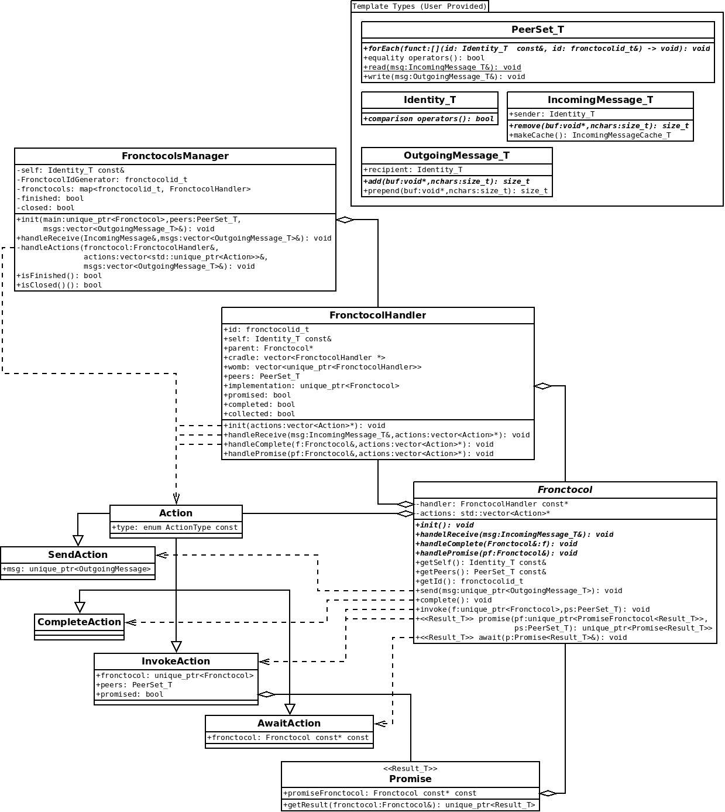

# Fortissimo Design

Fortissimo, the fronctocol framework, was concieved during the development SAFRN 1.0 as a mechanism for combining protocols to produce more complex protocols.
Fortissimo allows a programmer to combine protocols as one one combine functions.
The ability to combine protocols as functions is the root of Fortissimo's core tool's name: _fronctocol_.

To further understand this, do not think of a protocol as an exchange of information.
Instead consider a protocol a function which is evaluated by multiple parties.
in HTTP, instead of the client sending a requested path, and the server returning a document, the client inputs a path and the server inputs a document repository.
The HTTP function outputs to the client a specific document from the server's document repository, and to the server, the client's request.

Now consider a protocol which computes addition of each party's numeric input.
This protocol could be repeated to sum two vector's elements.

## Archietectural Design

### Template Parameters
As a library for multiple projects, Fortissimo must support the roles and identity management tools of multiple projects.
To this end the following template types are required by Fortissimo.

 - ``Identity_T``: This template parameter is a succinct representation of a participant.
   The ``Identity_T`` is required only to have its comparison operators defined, and maybe copy/move constructors.
 - ``IncomingMessage``: An abstract class templatized on an ``Identity_T`` which encapsulates a message being received and deserialized.
 - ``OutgoingMessage``: An abstract class templatized on an ``Identity_T`` which encapsulates a message being serialized and then sent.
 - ``PeerSet_T``: An object of this type describes a set of peers or participants in a protocol.
   The ``PeerSet_T`` must have a ``forEach`` method which executes a ``lambda`` over each peer in the set.
   TODO: work out the details on this.
   The ``PeerSet_T`` must also be capable of serializing and deserializing itself in and out of ``IncomingMessage_T``s and ``OutgoingMessage_T``s.
 - ``PeerSet_T``: This is a template parameter which describes a set of participants/peers.
   An abstract ``PeerSet<Identity_T>`` is provided to best describe the requirements of the ``PeerSet_T``.
   Namely it must have three coindexed sets accessed and modified through a ``forEach(...)`` method.
    - ``peers : Identity_T``: the set of peers represented.
    - ``ids : fronctocolId_t``: the ID of each peer's fronctocol.
    - ``completions : bool``: an indication of whether each peer's fronctocol is complete.
  The ``PeerSet`` must also have an ``operator==`` defined, which must compare based only on the ``peers`` (ignoring ``ids`` and ``completions``).

### Fronctocols
Fortissimo's core tool is the Fronctocol.
A fronctocol is an event driven protocol handler.
In a simplified form, it must handle the following events

 - ``init()``: invoked exactly once when the fronctocol begins.
 - ``handleReceive(IncomingMessage&)``: invoked whenever a fronctocol receives a message.
   Fortissimo acts as a message passing framework, taking coherent sequences of bytes from a sending fronctocol and delivering them to a recipient.
   ``handleReceive`` is invoked when Fortissimo delivers a message.
 - ``handleComplete(Fronctocol&)``: After a fronctocol invokes a subfronctocol, ``handleComplete`` is invoked to indicate the subfronctocol has completed.
   Fortissimo acts as a stack machine and calling convention in sequencing invocation and completion of subfronctocols.
   Note, however that Fortissimo does not have the typical call-stack, instead the distributed nature of Fortissimo produces more of a call-tree.
 
A fronctocol can take the following actions when handling any of the above events.

 - ``send(unique_ptr<OutgoingMessage>)``: Send a message to a corresponding fronctocol.
 - ``invoke(unique_ptr<Fronctocol>, PeerSet_T)``: Invoke a new subfronctocol.
 - ``complete()``: Indicate that the current fronctocol is finished, and may be returned to its caller.

### Promises

A ``PromiseFronctocol`` is a special variety of fronctocol who's return value is not given to its caller.
Instead the caller is given a "coupon" to redeem the result of ``PromiseFronctocol``.
This "coupon" is called a ``Promise``, and can be redeemed by the caller, or by any other fronctocol to which the ``Promise`` is given.

Using promises can reduce latency when the inputs to a fronctocol are available at a point far before its output is required.
For example correlated randomness can often be generated before they are needed, and before the information they will process is even available.

A ``PromiseFronctocol<Result_T>`` is templatized on ``Result_T``, ensuring a standard way of retrieving results from it.
A fronctocol using promises may use the following additional actions in any of its event handlers.

 - ``unique_ptr<Promise<Result_T>> promise(unique_ptr<PromiseFronctocol<Result_T>>, PeerSet_T)``: Invoke a ``PromiseFronctocol`` and produce a ``Promise`` to redeem later.
 - ``await(Promise<Result_T>&)`` redeem a ``Promise``, causing the ``handlePromise`` event handler to be invoked.

The ``handlePromise(Fronctocol&)`` event handler is called when a ``PromiseFronctocol`` completes.
The first ``Fronctocol`` to call ``await`` on the ``PromiseFronctocol`` is given it to retrieve the result.
The ``Promise<Result_T>`` can use its ``unique_ptr<Result_T> getResult(Fronctocol&)`` method to test which promise was redeemed (in the case of multiple simultaneous promises), and to collect the promised result.

### Networking

Fortissimo, unlike SAFRN's original fronctocol framework, is designed with network independence in mind.
While this poses certain challenges it makes Fortissimo a very versatile tool.
The network input and output of Fortissimo is handled through the ``IncomingMessage_T`` and ``OutgoingMessage_T`` templates.
The network loop itself is expected to pass ``IncomingMessage_T``s to Fortissimo, and accept ``OutgoingMessage_T``s to be sent.

While Fortissimo is indeed network agnostic, it will eventually provide networking implementations for TCP and TLS.

Before continuing, it may be prudent to become familiar with Fortissimo's [control protocol](protocol.md)

## Detailed Design

Pictured in the UML are the classes which make up Fortissimo as well as the template types which must be provided by the user.
Template types are described breifly above, and will be further described by abstract classes to help implement each type.
The ``FronctocolHandler`` class is a small wrapper class for a fronctocol, which assists the ``FronctocolsManager`` in some of the synchronization tasks necessary to make Fortissimo work.
The ``Fronctocol`` class is an abstract class for users to implement, granting them all the benefits of composing protocols with Fortissimo.
The ``FronctocolsManager`` class is the core logic of Fortissimo, performing most of the work to schedule and manage all the fronctocols.

The notable methods of ``FronctocolHandler`` are essentially wrappers for the corresponding virtual methods of ``Fronctocol``.
The methods of ``FronctocolHandler`` grant ``Fronctocol`` access to a list of ``Actions``, enabling the non-virtual methods of ``Fronctocol`` to communicate new actions to the ``FronctocolsManager``.
Before completing, methods of ``FronctocolHandler`` reset a wrapped fronctocol's ``actions`` vector to ``nullptr`` to avoid inadvertant and lost actions.

``FronctocolHandler`` also has the following attributes.

 - ``id : fronctocolid_t``: This fronctocol's ID.
 - ``self : Identity_T const&``: A reference to the identity of the fronctocol's owning participant.
 - ``parent : Fronctocol*``: The fronctocol which invoked this one, or in the case of a ``PromiseFronctocol``, the fronctocol which ``await``s this one.
 - ``cradle : vector<FronctocolHandler *>``: Child fronctocols which this one invoked, but which haven't yet received init messages from all their peers.
 - ``womb : vector<unique_ptr<FronctocolHandler>>``: Child fronctocols whose peers have sent init messages for, but which have yet to be invoked by this fronctocol.
 - ``peers : PeerSet_T``: The set of peers to this fronctocol.
 - ``implementation: unique_ptr<Fronctocol>``: The user object defining this fronctocol's protocol.
 - ``promised : bool``: Indicates if this fronctocol is a ``PromiseFronctocol``.
 - ``completed : bool``: Indicates if this fronctocol has invoked ``complete()`` yet, indicating that it is finished.
 - ``collected : bool``: indicates if the ``handleComplete`` of the parent has been invoked yet.

A semi detailed description of each of ``FronctocolsManager``'s methods is given.
Note, there are more methods listed than pictured in the UML Diagram, as certain methods of ``FronctocolsManager`` will be delegated to various child methods.

The pictured methods are as followed.

 - ``void init(main : unique_ptr<Fronctocol>, peers: PeerSet_T, msgs : vector<OutgoingMessage_T>&)``
   1. Insert a new ``FronctocolHandler`` for ``main`` with ``peers`` and ID 0 into the ``FronctocolsManager``.
      1. Set attributes of the ``Fronctocol`` and ``FronctocolHandler``.
         - ``handler.id`` to 0 (generated by the ``fronctocolIdGenerator`` variable to ensure it does not regenerate this ID).
         - ``handler.implementation`` to ``main``.
         - ``handler.implementation.handler`` to ``handler``. This feels a little redundant, but it is necessary because both need access to attributes of the other.
         - ``handler.peers`` set each ``fronctocolId`` in the set to 0, this always corresponds.
   2. Set the initialized flag on the FronctocolsManager.
   3. Invoke ``main.init(...)``.
      1. Create an empty list of ``Action``s and give it to ``main.init(...)``.
      2. ``main`` will fill the list with actions to perform.
      3. The ``FronctocolsManager`` handles the actions by calling ``handleActions(...)``.
   4. Handle each message cache, delegating to one of the helpers used by ``handleReceive(...)``.
      - Clear the message cache after handling each cache.
 - ``void handleReceive(IncomingMessage_T&, msgs : vector<OutgoingMessage_T>&)``
   1. Read the common fields of the message header, ``control block`` and ``fronctocol id``.
   2. If the abort flag is set, disregard the message.
   3. If the message is an abort message, invoke ``void handleAbort(msgs : vector<OutgoingMessage_T>&)``.
      1. Then return.
   3. look up the fronctocol in the map of fronctocols.
   4. If this FronctocolsManager isn't yet initialized, or if the Fronctocol doesn't have all its peers yet.
      - Cache the message into the FronctocolHandler.
      - return from ``handleReceive(...)``.
   5. Delegate processing to one of (using ``void distributeMessage(...)``).
      - ``void handleSyncMsg(msg : IncomingMessage_T&, f : FronctocolHandler&, msgs : vector<OutgoingMessage_T>&)``
      - ``void handlePayloadMsg(msg : IncomingMessage_T&, f : FronctocolHandler&, msgs : vector<OutgoingMessage_T>&)``
      - ``void handleCompleteMsg(msg : IncomingMessage_T&, f : FronctocolHandler&, msgs : vector<OutgoingMessage_T>&)``
 - ``void handleActions(fronctocol : FronctocolHandler&, actions : vector<unique_ptr<Action>>, msgs : vector<OutgoingMessage_T>&)``
   1. For each action, determine the type of action, and handle it appropriately using one of
      - if the abort flag is set, break the loop and return without processing further actions.
      - ``void handleInvokeAction(f : FronctocolHandler&, action : InvokeAction, msgs : vector<OutgoingMessage_T>&)``
      - ``void handleSendAction(f : FronctocolHandler&, action : SendAction, msgs : vector<OutgoingMessage_T>&)``
      - ``void handleCompleteAction(f : FronctocolHandler&, action : CompleteAction, msgs : vector<OutgoingMessage_T>&)``
      - ``void handleAwaitAction(f : FronctocolHandler&, action : AwaitAction, msgs : vector<OutgoingMessage_T>&)``
      - ``void handleAbortAction(msgs : vector<OutgoingMessage_T>&)``

The message handlers are as follows.

 - ``void handleSyncMsg(msg : IncomingMessage_T&, f : FronctocolHandler&, msgs : vector<OutgoingMessage_T>&)``
   - ``f`` is the parent of the fronctocol being initialized.
      The new fronctocol may be in the parents womb or cradle, or it may not yet exist.
   1. Read the peer set and the peer's child ID out of the message.
   2. Check the parent's cradle for a fronctocol matching the peerset, and not yet having a fronctocol ID from the sender.
      1. Add the incoming fronctocol id to the child's PeerSet.
      2. Check if the child fronctocol has all of its peers.
         1. Remove the child from the parent's cradle.
         2. Invoke the ``init`` method on the child.
         3. Handle actions produce by the child's ``init`` using ``handleActions(...)
         4. Also handle each incomingMessageCache using the helpers of ``handleReceive(...)``.
      3. Return from this method.
   3. Check the parent's womb for a fronctocol matching this peer set, and not yet having a fronctocol ID from the sender.
      1. If not found insert a new ``FronctocolHandler`` with the peer set and no fronctocol IDs.
   4. Update the senders fronctocol ID in the matching fronctocol in the parent's womb.
 - ``void handlePayloadMsg(msg : IncomingMessage_T&, f : FronctocolHandler&, msgs : vector<OutgoingMessage_T>&)``
   1. In debug mode, warn if the message is delivered to a completed fronctocol.
   2. invoke the ``handleRecieve`` method of the fronctocol, passing it the message, and an empty list of ``Actions``s.
   3. handle the actions using ``handleActions(...)``.
 - ``void handleCompleteMsg(msg : IncomingMessage_T&, f : FronctocolHandler&, msgs : vector<OutgoingMessage_T>&)``
   1. Mark in the fronctocol's peer set that the sender has completed.
   2. If the fronctocol was collected and all peers sent a completion message
      1. If the fronctocol was the main fronctocol, mark the entire ``FronctocolsManager`` as finished.
      2. Remove the fronctocol from the ``FronctocolsManager``.

The action handlers are as follows.

 - ``void handleInvokeAction(f : FronctocolHandler&, action : InvokeAction, msgs : vector<OutgoingMessage_T>&)``
   - ``f`` is the parent fronctocol, the child is an attribute of ``action``.
   - The peer set is also an attribute of ``action``.
   1. In debug mode, warn if the child was invoked with an empty peer set, or if it is missing itself from the peerset.
   2. Attempt to find a ``FronctocolHandler`` in the parents womb which matches the peerset.
      1. If a matching ``FronctocolHandler`` is found, remove it from the womb. It is now the child's handler.
   3. If no matching ``FronctocolHandler`` was found, create a new handler for the child.
   4. Fill out some missing attributes of the child and handler.
      - ``handler.id`` should be a new ID generated by incrementing ``FronctocolsManager.fronctocolIdGenerator``.
      - ``handler.self`` should be a reference to the ``FronctocolsManager.self``.
      - ``handler.parent`` should be either the parent's handler, or null if this fronctocol is a promise.
      - ``handler.peers`` should be the peer set from ``action``.
        This only needs to be updated if the handler is new, otherwise it has fronctocol IDs of peers which would get overwritten.
      - ``handler.peers[handler.self].id`` should be set to ``handler.id``.
        This must always be set.
      - ``handler.implementation`` should be the child fronctocol itself.
      - ``handler.promised`` Should be true if ``action.promised`` is true.
      - The remaining attributes of ``FronctocolHandler`` should default to empty or false.
      - ``child.handler`` should be a reference to its handler.
   5. Send a sync message to each of the child's peers.
   6. Check if the Fronctocol is ready to start, by checking if all of its peer's IDs have been received.
      1. Invoke the Fronctocol's ``init`` method, and then handle any new actions with ``handleFronctocolActions(...)``.
         - Also handle each incomingMessageCache using the helpers of ``handleReceive(...)``.
      2. otherwise insert the child's handler into the parent's cradle.
   7. Enter the child's ID and handler into the ``FronctocolsManager``.
 - ``void handleSendAction(f : FronctocolHandler&, action : SendAction, msgs : vector<OutgoingMessage_T>&)``
   1. In debug mode, warn if the intended recipient has already completed.
   2. Prepend a payload header and add the message to the ``msgs`` list.
 - ``void handleCompleteAction(f : FronctocolHandler&, action : CompleteAction, msgs : vector<OutgoingMessage_T>&)``
   1. Mark ``f`` as being ``completed``.
   2. Set ``f``'s own completion flag in its peer set.
   3. Send a complete message to each of ``f``'s peers.
   4. If ``f`` is not the ``main`` fronctocol (ID = 0), and ``f`` is not promised or ``f`` is promised, but has already been ``await``ed.
      1. Assert that the parent is not completed. If the parent is gone, this should also fail, but with a SIGSEGV, instead of an assert.
      2. call either ``handleCompete(...)``  or ``handlePromise(...)`` on ``f``'s parent.
      3. handle newly produced actions with ``handleFronctocolActions``.
      4. Mark ``f`` as being ``collected`` (its parent or awaiter was notified of completion).
   5. if ``f`` is the ``main`` fronctocol.
      1. mark ``f`` as being ``collected`` (``main`` does not have a parent, and is never-and-always collected).
      2. mark the ``FronctocolsManager`` as being finished.
   6. If ``f`` was collected and all of ``f``'s peers have also completed, remove ``f`` from the ``Fronctocols Manager``.
 - ``void handleAwaitAction(f : FronctocolHandler&, action : AwaitAction, msgs : vector<OutgoingMessage_T>&)``
   1. Check that the awaited fronctocol (``action.fronctocol``) is in this ``FronctocolsManager``.
      1. This would be an error condition, and indicates a bug in the running fronctocol.
   1. Check for error conditions which would indicate bugs in the fronctocols.
      1. The awaited fronctocol must exist.
      2. The awaited fronctocol must be a promise.
      3. The awaited fronctocol must not already be awaited.
   2. Assign to the awaited fronctocol, the awaiting fronctocol as a ("adopted") parent.
      - If Step 3 is not carried out, ``handleAwaitAction`` will return, and when the awaited fronctocol completes, it will notify the awaiting fronctocol.
   3. Check if the awaited fronctocol is ``completed``.
      1. Notify ``f`` immediately by invoking ``f.handlePromise(...)``, and then handling resulting actions with ``handleActions(...)``.
      2. Mark the awaited fronctocol as ``collected``.
      3. Check if all peers of the awaited fronctocol have completed, and if so, remove it from the ``FronctocolsManager``.
 - ``void handleAbort(msgs : vector<OutgoingMessage_T>&)``
   1. Send an abort message to each peer of main (id=0).
   2. Set the aborted flag.

The following methods of FronctocolsManager indicate completion status.

 - ``bool isFinished()``
   - Indicates that the main fronctocol completed.
   - The network need not respond to this.
 - ``bool isClosed()``
   - Indicates that after the main fronctocol completes, there are no more remaining fronctocols in processing (i.e. waiting for peers to send complete).
   - When this is indicated as true, the network may close connections.
 - ``bool isAborted()``
   - Indicates that either a fronctocol or fortissimo detected something went horribly wrong, and needs to end the protocol early.
   - Fortissimo will send abort messages to all of its peers.
   - Fortissimo will stop processing incoming messages, and will not produce any more outgoing messages.
   - The network **must** deliver all messages in the queue, Fortissimo sends an abort message to warn its peers.
     However, the network may drop incoming messages, if incoming messages are delivered, fortissimo will drop them.
